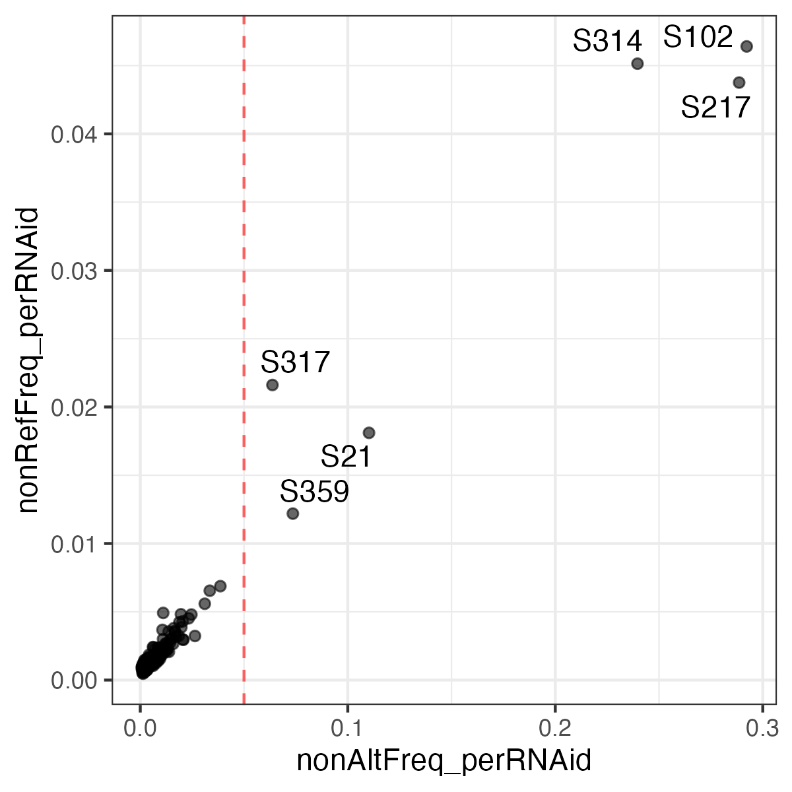
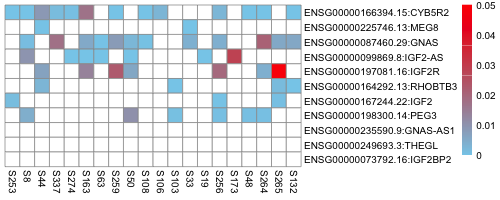
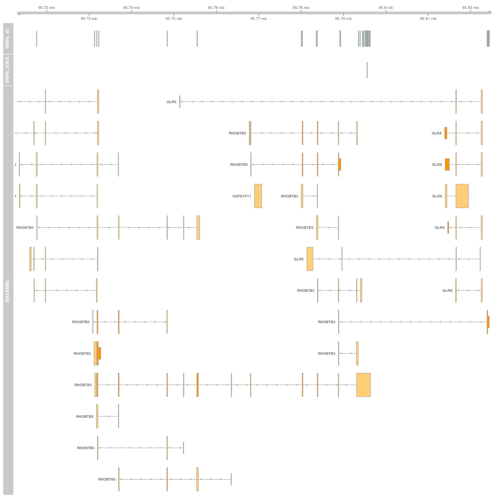
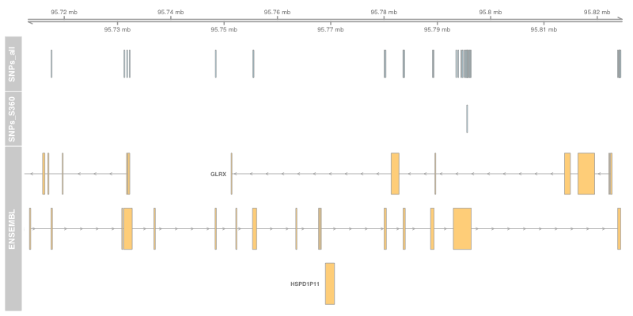
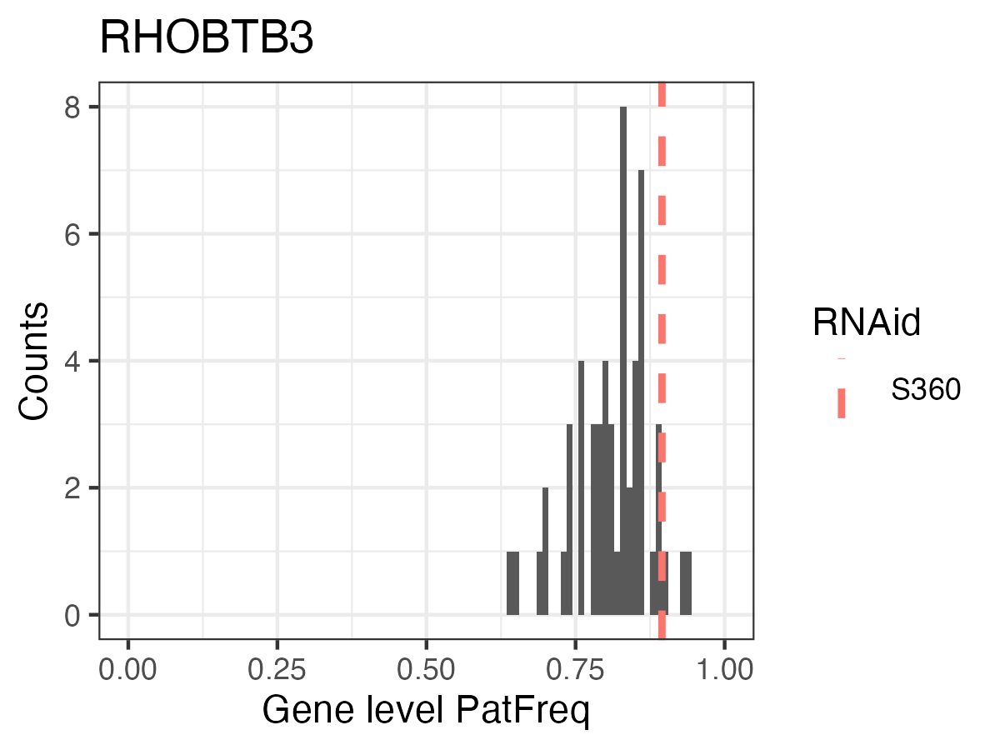
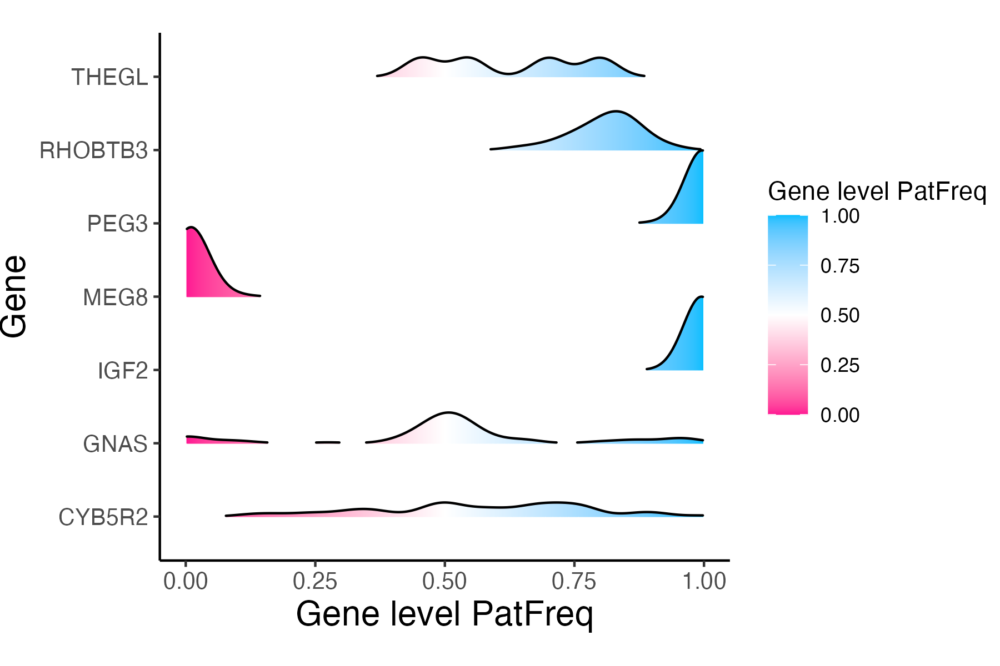
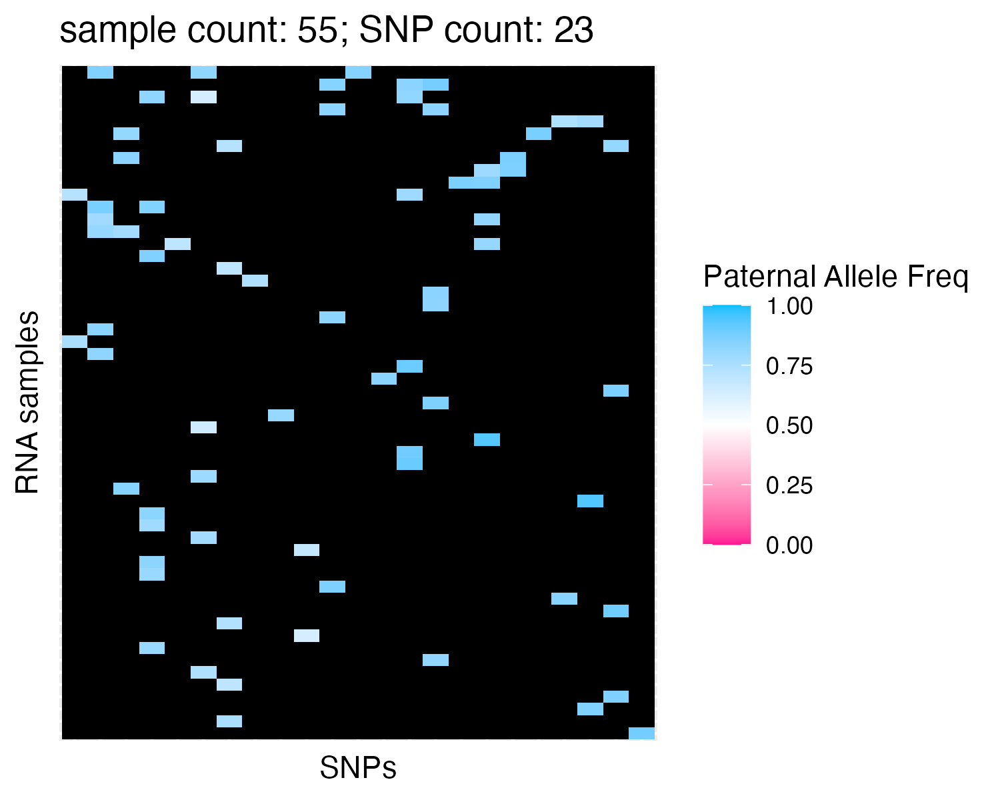
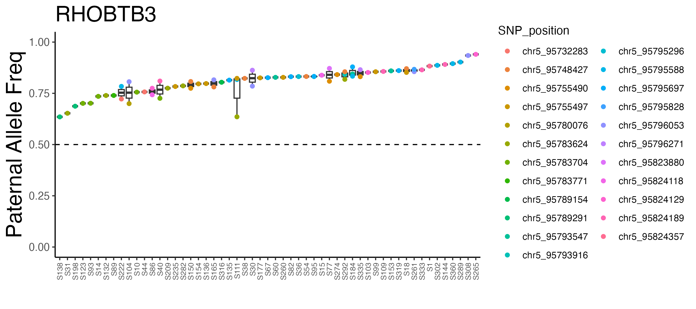
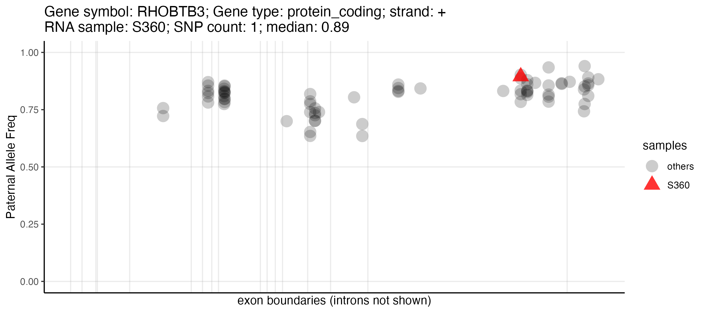

# ASEplot: Allele Specific Expression data plot

ASEplot is an R library used to generate visualization of allele-specific expression (ASE) data that is prepared using the Nextflow pipeline [ASET](https://github.com/weishwu/ASET).

## Installation
- ASEplot can be installed from GitHub. Ensure the following dependencies are installed: `tidyverse`, `ggrepel`, `pheatmap`, `Gviz`, `GenomicRanges`, `biomaRt`, and `ggridges`.
```
install.packages("remotes")
remotes::install_github("weishwu/ASEplot")
```
- For quick setup, an environment with ASEplot and all dependencies can be pulled via Docker or Singularity from [docker://weishwu/aseplot:0.0](https://hub.docker.com/repository/docker/weishwu/aseplot/general). For example:
```
singularity build aseplot.sif docker://weishwu/aseplot:0.0
```

## Load data and filter
```
library(Gviz)
library(GenomicRanges)
library(biomaRt)
library(ggridges)
library(tidyverse)
library(pheatmap)
library(ggrepel)
library(ASEplot)

# ASEplot comes with a small test data. For real data analysis, use readRDS to load in the .rds output from ASET.
data(ase_data.test)
ase_df = ase_data$ase_df
exons = ase_data$union_exons_per_gene

# Select only the lines with unique genes
ase_df_uniqGene = ase_df %>% filter(! grepl(';', genes_exonic)) %>% filter(!is.na(exons_merged))

# Filter data
ase_selc = ase_df_uniqGene %>% filter( 
    (totalCount >= 10) & 
    (!is.na(exons_merged)) & 
    (!grepl(';', exons_merged)) &
    (nonAltFreq_perRNAid < 0.05) &
    (nonRefFreq_perRNAid < 0.05) &
    ((homRef_nonRefFreq_atMatAlt_mean_perGene_perRNAid < 0.05) | is.na(homRef_nonRefFreq_atMatAlt_mean_perGene_perRNAid))) %>% 
    dplyr::select(
    RNAid,variantID,contig,position,refAllele,altAllele,strand,refCount,altCount,
    totalCount,rawASE,exons_merged,gene_type_exonic,
    PatAllele,MatAllele,PatDepth,MatDepth,PatFreq,genes_exonic,homRef_nonRefFreq_atMatAlt_mean_perGene_perRNAid)

# extract phased data
ase_selc_phased = ase_selc %>% filter(!is.na(PatAllele))
write.csv(ase_selc_phased, file = 'ase_selc_phased.csv', row.names = FALSE)
```

## Parent-of-origin testing
```
# if using the environment pulled from docker://weishwu/aseplot:0.0, simply run
po_test.jl ase_selc_phased.csv
```
- Output: megpeg_gene.csv
  - po: the estimated coefficient for PofO effect as the PofO score. |po| > 3 denotes strong parentally determined ASE, implying at least a 20-fold difference between the two alleles.
  - po_z: z-score of po. |po_z| > 3 denotes statistical significance.

## Plots

### Check contamination

- Check the distribution of sample contamination measured by the non-Alt-Freq at 1/1 sites, and non-Ref-Freq at 0/0 sites

```
contam = unique(ase_df_uniqGene %>% dplyr::select(RNAid, nonAltFreq_perRNAid, nonRefFreq_perRNAid))
ggplot(contam, aes(x=nonAltFreq_perRNAid, y=nonRefFreq_perRNAid)) + 
   geom_point(alpha=0.6) + 
   theme_bw() + 
   geom_vline(xintercept = 0.05, color='red', linetype='dashed',alpha=0.6) + 
   geom_text_repel(data = contam %>% filter(nonAltFreq_perRNAid > 0.05), aes(label = RNAid))
```



- Check contamination per sample and per gene

```
gene_contam = unique(ase_df_uniqGene %>% 
   filter(! is.na(homRef_nonRefFreq_atMatAlt_mean_perGene_perRNAid)) %>% 
   dplyr::select(RNAid, genes_exonic,homRef_nonRefFreq_atMatAlt_mean_perGene_perRNAid))

gene_contam = gene_contam %>% 
   pivot_wider(id_cols = genes_exonic, 
               names_from = RNAid, 
               values_from = homRef_nonRefFreq_atMatAlt_mean_perGene_perRNAid) %>% 
   column_to_rownames('genes_exonic')

pheatmap(gene_contam[,1:20], 
         cluster_cols = FALSE, 
         cluster_rows = FALSE, 
         na_col ='white',color = colorRampPalette(c("skyblue", "red"))(500),
         breaks = seq(0, 0.05, 0.05/500))
```



### SNP location relative to a given gene

- With transcripts split
```
snp_location(ase_selc, exons, 'RHOBTB3', 'split', 'hg38', 'S360')
```


- With transcripts collapsed
```
snp_location(ase_selc, exons, 'RHOBTB3', 'collapse', 'hg38', 'S360')
```



### Gene-level average POE (Parent-Of-Origin) ASE for a given gene across samples
```
gene_poe_histogram(ase_selc, 'RHOBTB3', 'pat-freq', sample_name = 'S360')
```



### Gene-level average POE ridge plot comparing multiple genes
```
gene_poe_ridge(ase_selc, c('MEG8', 'CYB5R2', 'IGF2', 'RHOBTB3', 'THEGL', 'GNAS', 'PEG3'), 'pat-freq')
```



### SNP-level ASE for a given gene in a heatmap
```
snp_gene_ase_heatmap(ase_selc, exons, 'RHOBTB3', 'pat-freq')
```



### SNP-level ASE for a given gene in a box plot
```
snp_gene_ase_boxplot(ase_selc, 'RHOBTB3', 'pat-freq') 
```


### SNP-level ASE for a given gene in a scatter plot
```
snp_gene_ase_scatter(ase_selc,exons,'RHOBTB3','pat-freq','S360')
```


## Citation
- Manuscript under peer review: https://doi.org/10.21203/rs.3.rs-6844336/v1
