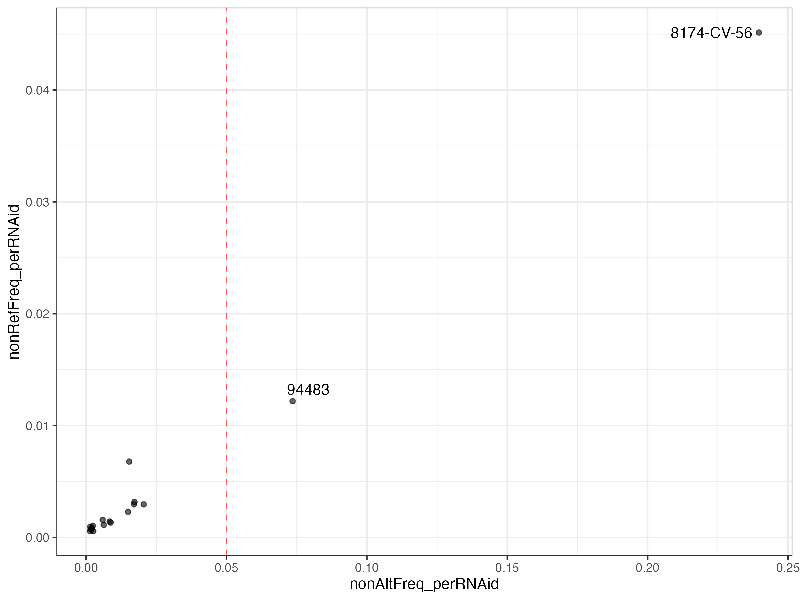
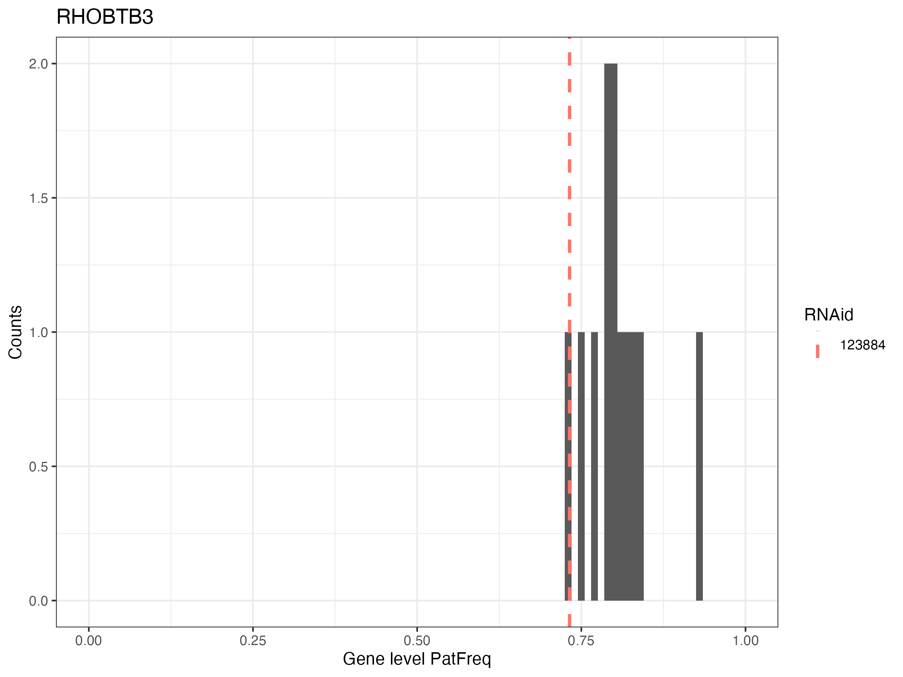
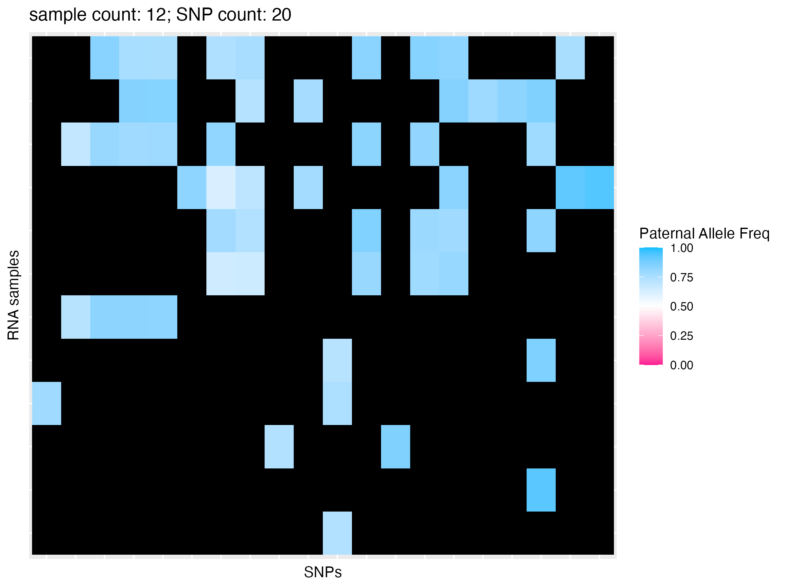
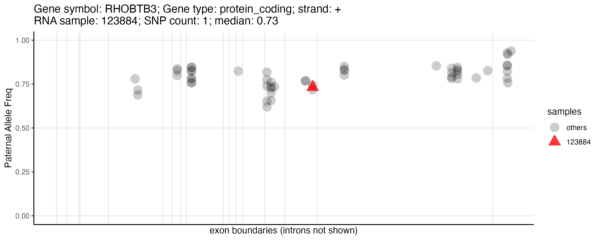

# ASEplot: Allele Specific Expression data plot

ASEplot is an R library used to generate visualization of allele-specific expression (ASE) dat
a that is prepared using the Nextflow pipeline [ASET](https://github.com/weishwu/ASET).

## Load data and filter
```
library(ggplot2)
library(Gviz)
library(GenomicRanges)
library(biomaRt)
library(ggridges)
library(dplyr)
library(tidyverse)
library(pheatmap)
library(ggrepel)
library(ASEplot)

ase_data = readRDS('~/Downloads/ase_data.realdata.Rds')

ase_df = ase_data$ase_data
exons = ase_data$union_exons_per_gene

# Select only the lines with unique genes
ase_df_uniqGene = ase_df %>% filter(! grepl(':', gene_from_exons))

# Filter data
ase_selc = ase_df_uniqGene %>% filter( 
    (totalCount >= 10) & 
    (!is.na(mergedExons_all)) & 
    (!grepl(':', mergedExons_all)) &
    (nonAltFreq_perRNAid < 0.05)) %>% dplyr::select(
    RNAid,variantID,contig,position,strand,refCount,altCount,totalCount,rawASE,mergedExons_all,mergedExons_all_geneType_code,PatAllele,MatAllele,PatDepth,MatDepth,PatFreq,gene_name_from_exons,gene_id_from_exons,gene_from_exons)

# extract phased data
ase_selc_phased = ase_selc %>% filter(!is.na(PatAllele))
write.csv(ase_selc_phased, file = 'ase_selc_phased.csv', row.names = FALSE)
```

## Parent-of-origin testing
```
julia inst/julia/po_test.jl ase_selc_phased.csv
```
- Output: megpeg_gene.csv
  - po: the estimated coefficient for PofO effect as the PofO score. |po| > 3 denotes strong parentally determined ASE, implying at least a 20-fold difference between the two alleles.
  - po_z: z-score of po. |po_z| > 3 denotes statistical significance.

## Plots

### Check contamination

- Check the distribution of sample contamination measured by the non-Alt-Freq at 1/1 sites, and non-Ref-Freq at 0/0 sites

```
contam = unique(ase_df_uniqGene %>% select(RNAid, nonAltFreq_perRNAid, nonRefFreq_perRNAid))
ggplot(contam, aes(x=nonAltFreq_perRNAid, y=nonRefFreq_perRNAid)) + 
   geom_point(alpha=0.6) + 
   theme_bw() + 
   geom_vline(xintercept = 0.05, color='red', linetype='dashed',alpha=0.6) + 
   geom_text_repel(data = contam %>% filter(nonAltFreq_perRNAid > 0.05), aes(label = RNAid))
```



- Check contamination per sample and per gene

```
gene_contam = unique(ase_df_uniqGene %>% 
   filter(! is.na(homRef_nonRefFreq_mean_perGene_perRNAid)) %>% 
   select(RNAid, gene_from_exons,homRef_nonRefFreq_mean_perGene_perRNAid))

gene_contam = gene_contam %>% 
   pivot_wider(id_cols = gene_from_exons, 
               names_from = RNAid, 
               values_from = homRef_nonRefFreq_mean_perGene_perRNAid) %>% 
   column_to_rownames('gene_from_exons')

pheatmap(gene_contam[1:40,1:20], 
         cluster_cols = FALSE, 
         cluster_rows = FALSE, 
         na_col ='white',color = colorRampPalette(c("skyblue", "red"))(500),
         breaks = seq(0, 0.05, 0.05/500))
```


### SNP location relative to a given gene

- With transcripts split
```
snp_location(ase_selc, exons, 'RHOBTB3', 'split', '94965')
```


- With transcripts collapsed
```
snp_location(ase_selc, exons, 'RHOBTB3', 'collapse', '94965')
```


### Gene-level average POE (Parent-Of-Origin) ASE for a given gene across samples
```
gene_poe_histogram(ase_selc, 'RHOBTB3', 'pat-freq', sample_name = '94965')
```



### Gene-level average POE ridge plot comparing multiple genes
```
gene_poe_ridge(ase_selc, c('MEG8', 'CYB5R2', 'IGF2', 'RHOBTB3', 'THEGL', 'GNAS', 'PEG3'), 'pat-freq')
```


### SNP-level ASE for a given gene in a heatmap
```
snp_gene_ase_heatmap(ase_selc, exons, 'RHOBTB3', 'pat-freq')
```



### SNP-level ASE for a given gene in a box plot
```
snp_gene_ase_boxplot(ase_selc, 'RHOBTB3', 'pat-freq') 
```


### SNP-level ASE for a given gene in a scatter plot
```
snp_gene_ase_scatter(ase_selc,exons,'RHOBTB3','pat-freq','94965')
```


